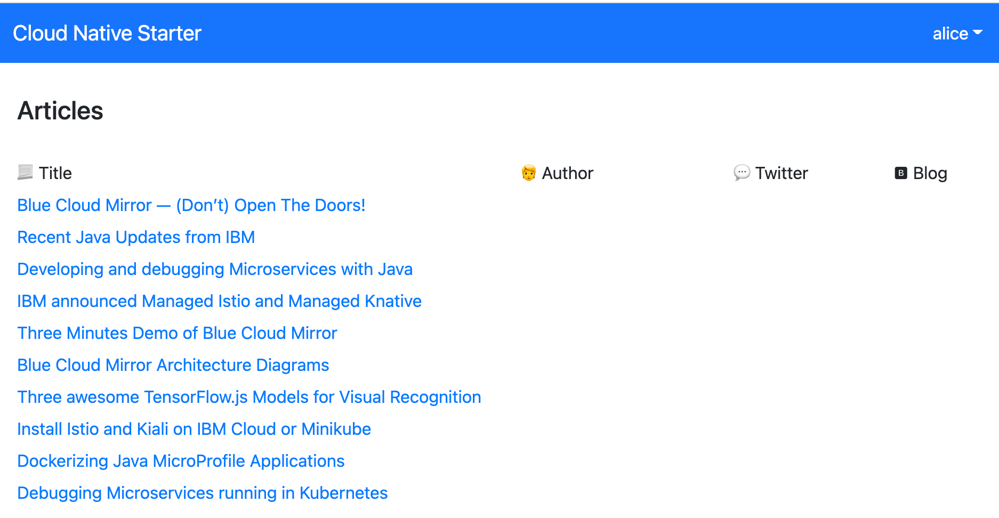

# Workshop: Get Started with deploying a Java Microservices Application to `Code Engine`

**------------------**
**UNDER CONSTRUCTION**
**------------------**

### Objectives

After you complete this workshop, you'll have a basic understanding of the following:

* Deploying an existing example microservices based application to `Code Engine`
    * See the usage of the `IBM Cloud Code Engine CLI` and `kubectl` in the bash script automation
* Use the `Out-Of-The-Box` monitoring for the example application
* Use the `Out-Of-The-Box` logging for the example application

> _The scope of this workshop is not to explain every aspect of application running a application with `Code Engine`._

### Architecture

The example application simply shows articles protected with an `Identity and Access Manegement`.
In the following picture you see the frontend with the articles and the valid user `alice` is logged on.

The following diagram shows the architecture of the sample application. There is a `web-app` frontend application that serves the Javascript/Vue.js code to the browser. The `web-app` code running in the browser invokes a REST API of the `web-api` microservice. The `web-api` microservice in turn invokes a REST API of the `articles` microservice. [`Keycloak`](https://www.keycloak.org/) is used for the `Identity and Access Manegement` of that microservices based application. To see the results in the web application, users need to be authenticated and they need to have the role `user`.

The image below shows the dependencies of the example:

* External and internal routing

In our context it's useful to have a basic understanding of the routing for example application. Based on the functionality of the application, we need `three external routes` for the example application, that the example works on internet.

Each external route communication will be automaticly secured with an [TLS Certificate](https://en.wikipedia.org/wiki/Transport_Layer_Security)created by `Code Engine` using [Let's encrypt](https://letsencrypt.org/). The three applications are, the `web-app` will be loaded into the browser, the keyloak which must be available for the authentication/authorization to our application and for potential configruation the `Identity and Access Manegement` and finally the `web-api` microservice, which provides the articles data and will be invoked be the `web-app`.

The `articles` microservice doesn't need an to be invoked from external, so it's configured to provide only an `internal route`, which is used by the  `web-api` microservice to get the articles from.

* Basics about the deployment

For an easy deployment prebuild containers were and push to a [Quay container registry](https://quay.io/user/tsuedbroecker).
In the following table you see the **application**/container, the exposed **routes**, uses of **TLS Certificate**, the **scale to zero** configuration and the **container registry** where the prebuild container come from.

| **Application** | **Route** | **TLS Certificate** | **Scale to zero** | **Container Registry** | 
| --- | --- | --- | --- |  --- |
| web-app | external | yes |yes | Quey |
| keycloak | external | yes | no | Docker |
| web-api  | external | yes | yes | Quey |
| articles | internal | no | yes | Quey |

_Note:_ The project also contains also the source code, which you use to create an own version of the microservices based application.

### Estimated time and level

|  Time | Level  |
| - | - |
| 30 min | beginners |

### About this workshop

<!-- The introductory page of the workshop is broken down into the following sections:

* [Agenda](#agenda)
* [Compatibility](#compatibility)
* [Technology Used](#technology-used)
* [Credits](#credits)
* [What`s next?](#whats-next?) -->

### Agenda

These are the sections of this workshop, go through all of them in sequence, start with `1. Setup the example application` :

 1. [Setup the example application](./setup-example.md)

### Compatibility

* [Code Engine](https://cloud.ibm.com/docs/codeengine?topic=codeengine-about)
    
### Technology Used

* [Knative](https://knative.dev/)
* [Kubernetes](https://knative.dev/)
* [Microservices architecture](https://en.wikipedia.org/wiki/Microservices)
* [KEYCLOAK](https://www.keycloak.org)
* [Jakarta EE](https://jakarta.ee/)
* [MicroProfile](https://microprofile.io/)
* [Quarkus](https://quarkus.io/ingress)
* [Vue.js](https://vuejs.org/)
* [NGINX](https://www.nginx.com/)
* [git 2.24.1 or higher](https://git-scm.com/book/en/v2/Getting-Started-Installing-Git)
* [yarn 1.22.4 or higher](https://yarnpkg.com)
* [Node.js v14.6.0 or higher](https://nodejs.org/en/)
* [Apache Maven 3.6.3](https://maven.apache.org/ref/3.6.3/maven-embedder/cli.html)

### Credits

**TBD**

### Additional resources

**TBD**

