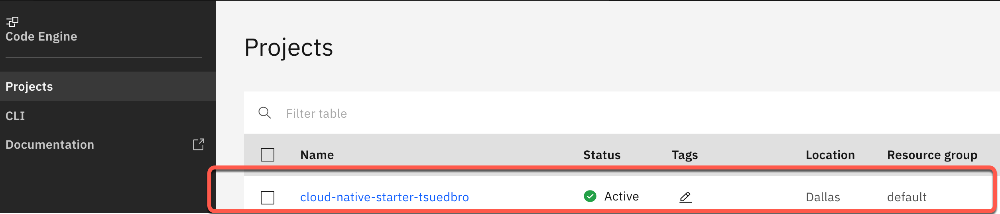
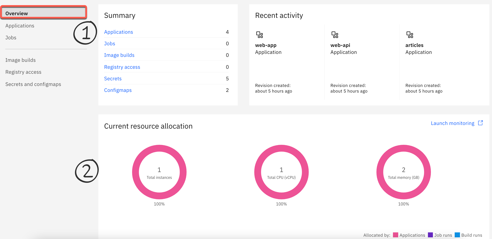
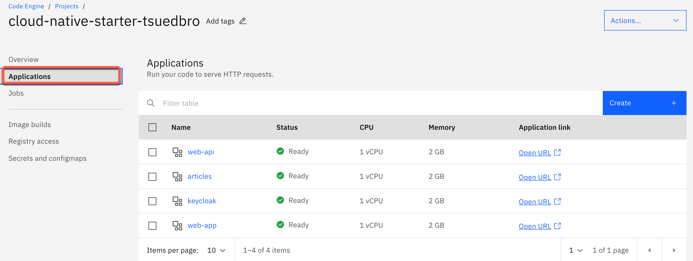
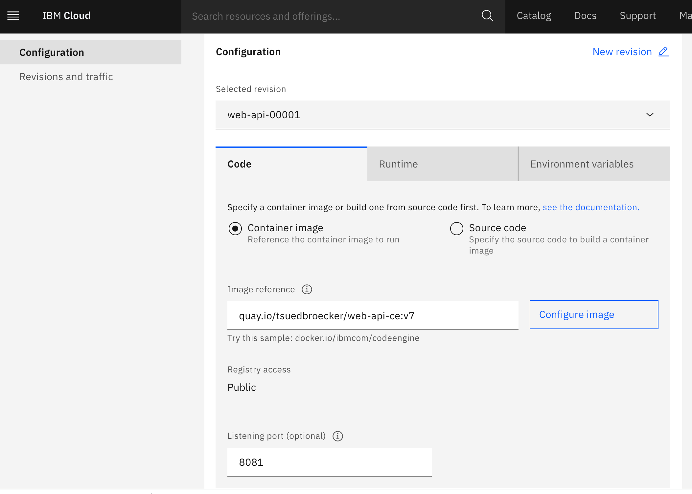
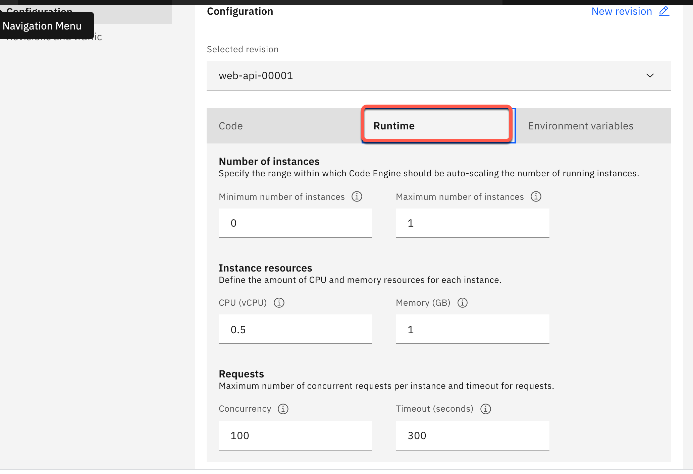

# Inspect the `Code Engine` project created for the example application

### Step 1: Open the `Code Engine` project

Use following link to directly navigate to the Code Engine projects and open the created project.

<https://cloud.ibm.com/codeengine/projects>

### Step 2: Select `Overview`

In the following image you see:

1. The summary containing the Applications, Jobs, Image builds, Registry access, Secrets and Configmaps.In our case only the four applications are relevant.
2. The currenly usage of our application.

### Step 3: Select `Applications`

Here you find an overview of the currenly running applications. ( FYI `Code Engine` definition: `A program that serves HTTP requests`)

### Step 4: Open the `web-api` application

Here we find the configuration for the application. 

* First select to `Code` tab. Here you see our container image reference to the Quay container registry.

* Then select to `Runtime` tab. The configuration for the instances, vCPU, memory and requests.

_Note:_ For more details about valid vCPU and Memory combinations please visit the documentation [here](https://cloud.ibm.com/docs/codeengine?topic=codeengine-mem-cpu-combo) .