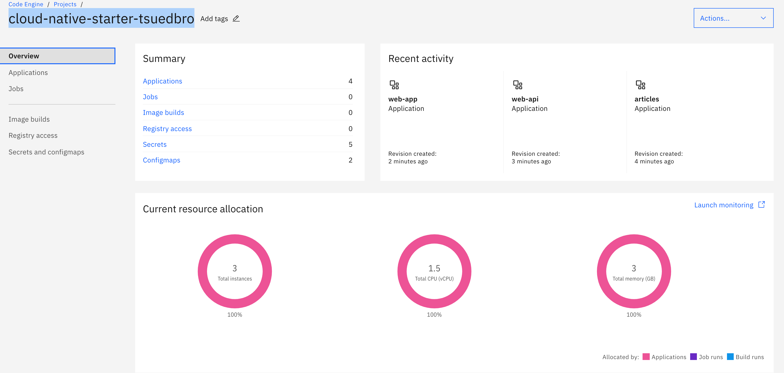
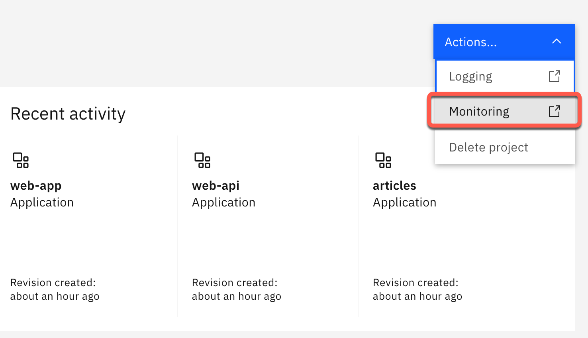
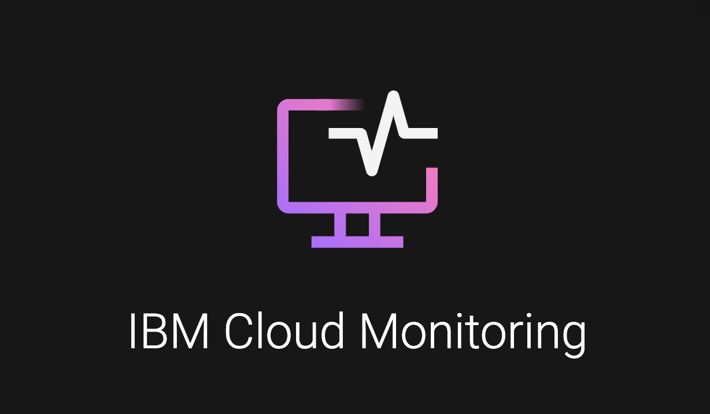

# Lab 3: Application Monitoring

**------------------**
**UNDER CONSTRUCTION**
**------------------**

Here we use the [IBM Cloud Monitoring](https://cloud.ibm.com/docs/monitoring?topic=monitoring-getting-started#getting-started) (lite plan).

### Step 1: Go back to the project overview

### Step 2: Select `Actions -> Monitoring`

### Step 3: This opens the IBM Cloud Monitoring for the `Code Engine`

### Step 4: Inspect the monitoring posibilities

For more details please use the [IBM Cloud Code Engine documentation for monitoring](https://cloud.ibm.com/docs/codeengine?topic=codeengine-monitor).

---

 > Congratulations, you have successfully completed this hands-on lab `Application Monitoring` of the workshop. Awesome :star: