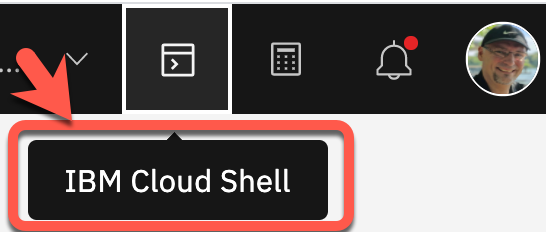
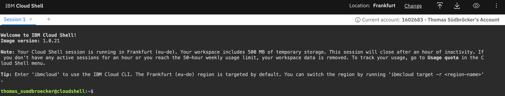
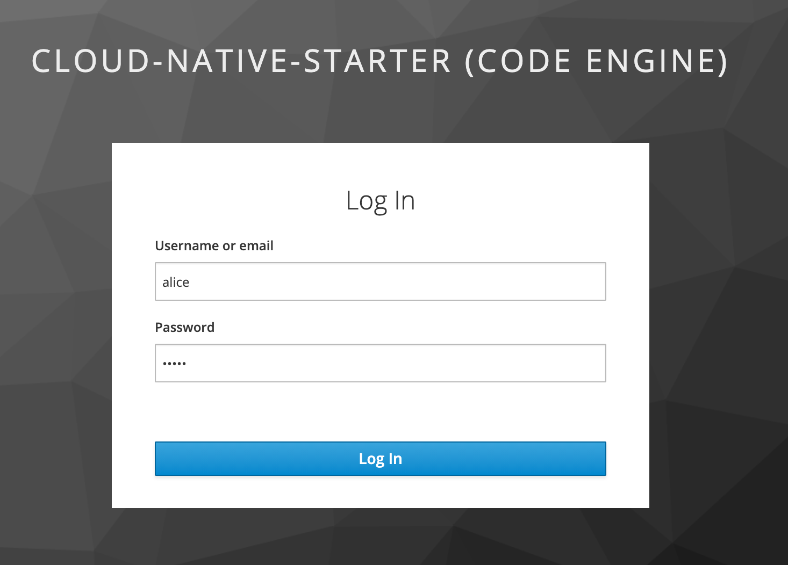
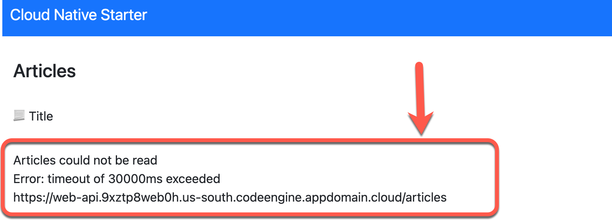
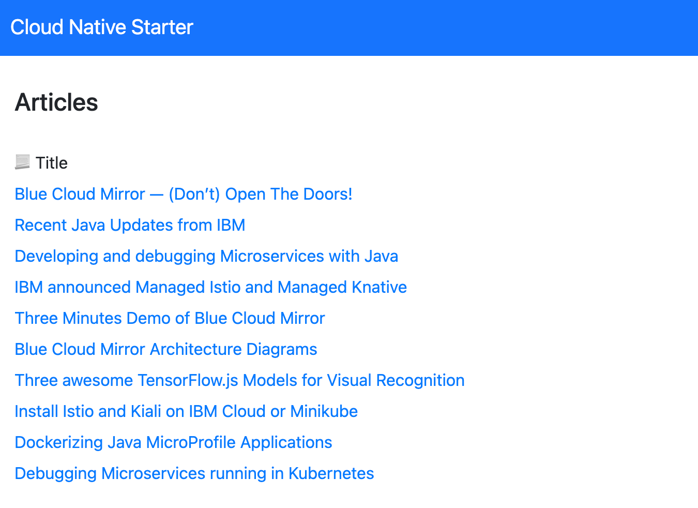

# Setup the example application

**------------------**
**UNDER CONSTRUCTION**
**------------------**

### Step 1: Create a `PayAsYouGo` IBM Cloud Account

Open this [link]() and follow the guided steps.

### Step 2: Logon to IBM Cloud and navigate to the Code Engine projects

Use following link to directly navigate to the Code Engine projects in IBM Cloud.

<https://cloud.ibm.com/codeengine/projects>

### Step 3: Navigate to Code Engine projects in IBM Cloud and press `Create`


### Step 4: Create a `Code Engine` project called `cloud-native-starter`

Enter following values and select create and wait until your project is created.

* Location      : `Dallas`
* Name          : `cloud-native-starter-[YOUR-EXTENTION]` (The name must be unique in the in Cloud Location `Dallas`)
* Resource group: `default`


The image below shows the created `Code Engine` project.


### Step 6: Open the `IBM Cloud Shell`

Use following link to directly open the `IBM Cloud Shell`.

<https://cloud.ibm.com/shell>

Or open the IBM Cloud Shell from here:



### Step 7: `IBM Cloud Shell`



### Step 8: Clone the GitHub project to the `IBM Cloud Shell

Insert these commands to clone the GitHub project to the `IBM Cloud Shell`

```sh
git clone https://github.com/thomassuedbroecker/ce-cns.git
cd ce-cns
ROOT_FOLDER=$(pwd)
```

### Step 9: Now set the environment variable to later usage with your Code Engine project name

> REMEMBER! `cloud-native-starter-[YOUR-EXTENTION]`

```sh
cd $ROOT_FOLDER/CE
export MYPROJECT=cloud-native-starter-[YOUR-EXTENTION]
```

### Step 10: Execute following bash automation

> Don't worry, this script may take several minutes.

```sh
bash ce-deploy-apps.sh
```

For a better understanding here are the simplified steps that are carried out in the script using the IBM Cloud `Code Engine CLI` and `kubectl CLI`:

1. Prepare the [Code Engine CLI](https://cloud.ibm.com/docs/codeengine?topic=codeengine-cli) for later usage and get the **namespace** for later usage, with [`kubectl`](https://kubernetes.io/docs/reference/kubectl/overview/).
2. Deploy `web-app` to get needed route for the redirect of Keycloak 
3. Deploy `Keycloak` simply as a container (that's the reason why not scale to zero (stateful)) 
4. Configure the `Keycloak` realm json file based on the web-app url and create realm.
5. Deploy `articles` microservice is defined as `local cluster` here we need to use the `namespace`.
6. Deploy `web-api` with needed `Keycloak` and articles urls as environment variables.
7. Reconfigure `web-app` with the needed `Keycloak` and web-api urls as environment variables.

Relevant for your configuration are following variables in the bash script:

```sh
export PROJECT_NAME=$MYPROJECT #your project name
export RESOURCE_GROUP=default #the resource group you defined during the creation of the project
export REPOSITORY=tsuedbroecker #the name of the public container repository on Quay
export REGION="us-south" #the region with is used when you choose Dallas as location during the creation of the project
```

:

You can open the example application with the `Web-App` link. 

```sh
************************************
 URLs
************************************
 - Keycloak : https://keycloak.9xztp8web0h.us-south.codeengine.appdomain.cloud/auth/admin/master/console/#/realms/quarkus
 - Web-API  : https://web-api.9xztp8web0h.us-south.codeengine.appdomain.cloud
 - Articles : http://articles.9xztp8web0h.svc.cluster.local/articles
 - Web-App  : https://web-api.9xztp8web0h.us-south.codeengine.appdomain.cloud
 ```

 ### Step 12: Open  the example application in your browser

 Use `user: alice` and `password: alice` for the logon.

 

 > Because of scale to zero it could be that the first invocation of the articles cloud take longer. 
 
 
 
 
Just refresh the browser and you should see following page.

 