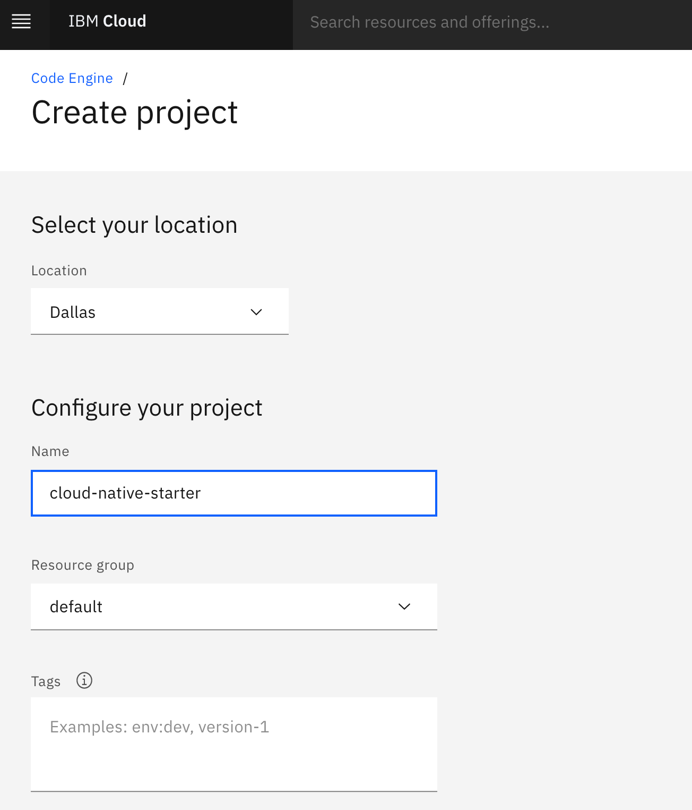

# Setup the example application

**------------------**
**UNDER CONSTRUCTION**
**------------------**

### Step 1: Create a `PayAsYouGo` IBM Cloud Account

### Step 2: Logon to IBM Cloud and navigate to the Code Engine projects

Use following link to directly navigate to the Code Engine projects in IBM Cloud.

<https://cloud.ibm.com/codeengine/projects>

### Step 3: Navigate to Code Engine projects in IBM Cloud and press `Create`


### Step 4: Create a `Code Engine` project called `cloud-native-starter`

Enter following values and select create and wait until your project is created.

* Location      : `Dallas`
* Name          : `cloud-native-starter-[YOUR-EXTENTION]` (The name must be unique in the in Cloud Location `Dallas`)
* Resource group: `default`




### Step 5: Clone the GitHub project to the `IBM Cloud Shell`

1. Use following link to directly open the `IBM Cloud Shell`.

<https://cloud.ibm.com/shell>

2. Insert these commands to clone the GitHub project to the `IBM Cloud Shell`

```sh
git clone https://github.com/thomassuedbroecker/ce-cns.git
cd ce-cns
ROOT_FOLDER=$(pwd)
```

### Step 6: Now set the environment variable to later usage with your Code Engine project name

> REMEMBER! `cloud-native-starter-[YOUR-EXTENTION]`

```sh
cd CE
export MYPROJECT=cloud-native-starter-[YOUR-EXTENTION]
```

### Step 7: Execute following bash automation

> The execution can take several minutes.

```sh
bash ce-deploy-apps.sh
```

The bash script does following simplified steps:

1. Prepare the [Code Engine CLI](https://cloud.ibm.com/docs/codeengine?topic=codeengine-cli) for later usage and get the **namespace** for later usage, with [`kubectl`](https://kubernetes.io/docs/reference/kubectl/overview/).
2. Deploy `web-app` to get needed route for the redirect of Keycloak
3. Deploy `Keycloak` simply as a container (that's the reason why not scale to zero (stateful))
4. Configure the `Keycloak` realm json file based on the web-app url and create realm.
5. Deploy `articles` microservice is defined as `local cluster` here we need to use the `namespace`.
6. Deploy `web-api` with needed `Keycloak` and articles urls as environment variables.
7. Reconfigure `web-app` with the needed `Keycloak` and web-api urls as environment variables.
